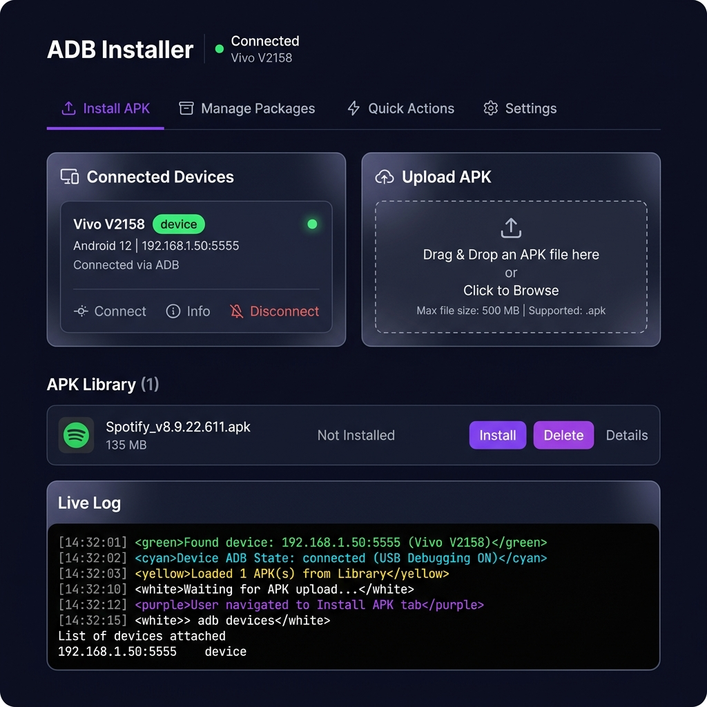

<div align="center">

# adb-webui

A web-based ADB tool that runs locally in your browser. Install APKs, manage packages, reboot your device — without touching the terminal.

[](https://www.npmjs.com/package/adb-webui)
[](https://www.npmjs.com/package/adb-webui)
[](LICENSE)
[](https://nodejs.org)

</div>

---



---

## What it does

- Drag and drop an APK → click install. Done.
- Auto-detects connected ADB devices, refreshes every 8 seconds
- Live log output over WebSocket so you can see exactly what ADB is doing
- Browse and uninstall installed packages from a list
- Quick actions: reboot, recovery, bootloader, logcat, kill/start ADB server
- Confirmation dialog before anything destructive
- Works even if `adb` isn't in your PATH — just point it to the binary in settings

No Electron. No framework. Just Node.js and a browser tab.

---

## Getting started

### Run without installing

```bash
npx adb-webui
```

Opens at `http://localhost:3737` automatically.

### Install globally

```bash
npm install -g adb-webui
```

Then just run `adb-webui` from anywhere.

### Clone and run

```bash
git clone https://github.com/shubhamsoni24/adb-web.git
cd adb-web
npm install
npm start
```

---

## Requirements

- Node.js 16+
- [Android Platform Tools](https://developer.android.com/tools/releases/platform-tools) (`adb`)
- A phone with USB Debugging enabled

---

## Enable USB Debugging

1. Go to **Settings → About Phone**
2. Tap **Build Number** 7 times to unlock Developer Options
3. Go to **Settings → Developer Options** → turn on **USB Debugging**
4. Plug in your phone and accept the prompt

---

## ADB not found?

If you get an error about ADB not being found, go to the **Settings** tab inside the app and set the path manually:

```
C:\platform-tools\adb.exe    # Windows
/usr/local/bin/adb           # macOS / Linux
```

---

## Project structure

```
adb-web/
├── server.js       # Express backend, ADB commands, WebSocket
├── index.html      # Frontend (vanilla JS/CSS, no build step)
├── bin/adb-webui.js  # CLI entry point for npx
└── package.json
```

---

## Security

- Only a small set of ADB shell commands are allowed through the UI
- APKs are stored locally on your machine, never uploaded anywhere
- The server only listens on localhost — not accessible from other devices

---

## Contributing

PRs are welcome. If you find a bug or want a feature, open an issue first so we can talk about it before you spend time building it.

---

## Roadmap

- [ ] Batch install multiple APKs at once
- [ ] Wireless ADB connect from the UI
- [ ] File transfer (push/pull)
- [ ] Screenshot and screen recording

---

## License

MIT © [shubhamsoni24](https://github.com/shubhamsoni24)
